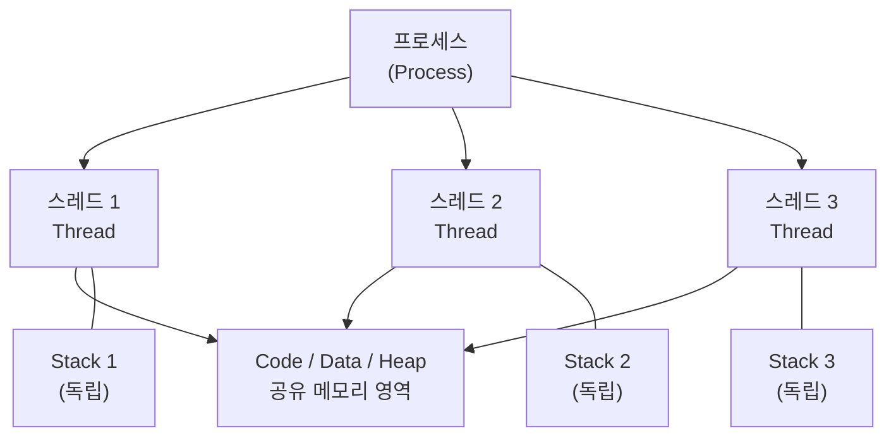
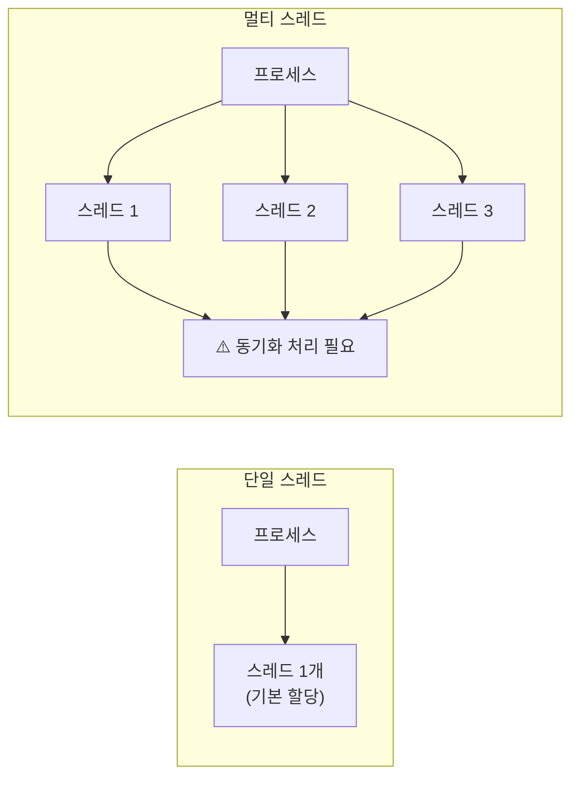
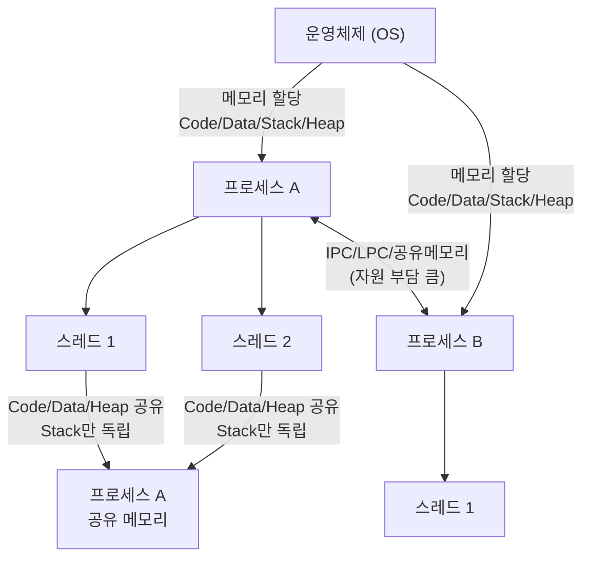

# 프로세스(Process)와 스레드(Thread)

> 면접 단골 질문이자 OS의 핵심 개념. 프로그램 → 프로세스 → 스레드 흐름을 완전히 이해하자.

---

## 목차
1. [정의](#1-정의)
2. [프로그램 → 프로세스](#2-프로그램--프로세스)
3. [프로세스 → 스레드](#3-프로세스--스레드)
4. [메모리 구조 비교](#4-메모리-구조-비교)
5. [단일 스레드 vs 멀티 스레드](#5-단일-스레드-vs-멀티-스레드)
6. [멀티 태스킹 vs 멀티 스레드](#6-멀티-태스킹-vs-멀티-스레드)
7. [멀티 스레드 장단점](#7-멀티-스레드-장단점)
8. [프로세스 간 정보 공유](#8-프로세스-간-정보-공유)
9. [프로세스 스케줄링 및 상태 변화](#9-프로세스-스케줄링-및-상태-변화)
10. [가상 메모리 관리와 스래싱](#10-가상-메모리-관리와-스래싱)
11. [페이지 크기에 따른 변화](#11-페이지-크기에-따른-변화)
12. [결론 및 면접 답변 정리](#12-결론-및-면접-답변-정리)

---

## 1. 정의

| 용어 | 정의 | 핵심 키워드 |
|------|------|------------|
| **프로세스** | 운영체제로부터 자원을 할당받은 **작업의 단위** | 작업, OS 최소 단위 |
| **스레드** | 프로세스가 할당받은 자원을 이용하는 **실행 흐름의 단위** | 실행 흐름, CPU 최소 단위 |

> 💡 **프로세스** = "어떤 일을 해야 하는가?"  
> 💡 **스레드** = "어느 순서로 수행할 것인가?"

---

## 2. 프로그램 → 프로세스

### 개념 흐름


### 핵심 정리

- **프로그램**: 아직 실행되지 않은 파일 그 자체 (정적인 상태)
  - 메모리에 올라가 있지 않음 → OS가 독립적인 메모리 공간을 아직 할당하지 않은 상태
  - 그냥 코드 덩어리
- **프로세스**: 프로그램을 실행한 것 (동적인 상태)
  - 메모리에 올라간 순간 → 프로세스가 됨
  - 스케줄링 단계에서의 "작업"과 같은 의미

> **한 줄 요약**: 프로그램은 코드 덩어리 파일, 그 프로그램을 실행한 게 프로세스.

---

## 3. 프로세스 → 스레드

### 왜 스레드가 필요한가?

과거에는 프로세스 하나로 프로그램 전체를 처리했지만, 프로그램이 복잡해지면서 한계가 생겼다.

**"한 프로그램을 처리하기 위한 프로세스를 여러 개 만들면 안 될까?"**

→ ❌ 불가능. OS는 안전성을 위해 **프로세스마다 자신에게 할당된 메모리 내의 정보에만 접근**할 수 있도록 제약을 둠.

그래서 더 작은 실행 단위 개념이 필요하게 됨 → **스레드(Thread)**

### 스레드의 핵심



- 스레드는 **프로세스와 다르게 스레드 간 메모리를 공유**하며 작동
- 코드에 비유하면: 프로세스 = 코드 전체, 스레드 = 코드 내에 선언된 함수들 (`main` 함수도 스레드)

> **한 줄 요약**: 스레드는 프로세스의 코드에 정의된 절차에 따라 실행되는 특정한 수행 경로다.

---

## 4. 메모리 구조 비교

### 프로세스의 독립 메모리 영역 (OS가 할당)

OS는 프로세스마다 각각 독립된 메모리 영역을 `Code / Data / Stack / Heap` 형식으로 할당한다.


### 스레드 간 공유 구조 (★ 핵심)

프로세스가 할당받은 메모리 영역 내에서:
- **Stack**: 스레드마다 **따로** 할당받음 (독립)
- **Code / Data / Heap**: 같은 프로세스 내 스레드끼리 **공유**


| 메모리 영역 | 역할 | 스레드 간 |
|------------|------|----------|
| **Code** | 실행할 코드 저장 | ✅ 공유 |
| **Data** | 전역변수, 정적변수 | ✅ 공유 |
| **Heap** | 동적 할당 메모리 (읽기/쓰기 모두 가능) | ✅ 공유 |
| **Stack** | 함수 호출, 지역변수 | ❌ 스레드마다 독립 |

> ⚠️ 힙 메모리를 공유하기 때문에 → **동기화 문제(Synchronization Issue)** 발생 가능

---

## 5. 단일 스레드 vs 멀티 스레드



- **단일 스레드**: 프로세스당 하나의 스레드가 기본적으로 할당됨
- **멀티 스레드**: 프로세스에 여러 개의 스레드가 할당됨 → **반드시 동기화 처리 필요**

---

## 6. 멀티 태스킹 vs 멀티 스레드

| 구분 | 멀티 태스킹 | 멀티 스레드 |
|------|------------|------------|
| **단위** | 여러 프로세스 | 하나의 프로세스 내 여러 스레드 |
| **메모리 공유** | ❌ 각자 독립 메모리 | ✅ Code/Data/Heap 공유 |
| **Context-Switching 비용** | 크다 (캐시 메모리 초기화 포함) | 작다 (공유 메모리만큼 절약) |
| **통신 방법** | IPC, LPC, 공유 메모리 (부담 큼) | 메모리 직접 접근 (빠름) |
| **오류 영향** | 다른 프로세스에 영향 없음 | 같은 프로세스 내 모든 스레드 종료 |

> ⚠️ 멀티 태스킹: 한 번에 여러 프로세스가 동시에 돌아가는 것이 아님.  
> 프로세스 간 **Context-Switching** 시 많은 자원 손실이 발생한다.

---

## 7. 멀티 스레드 장단점

### ✅ 장점

- **Context-Switching 비용 절감**: 공유하고 있는 메모리만큼의 메모리 자원을 아낄 수 있다.
- **통신 부담 적음**: 스레드는 Stack 영역을 제외한 모든 메모리를 공유하기 때문에 통신의 부담이 적어서 응답 시간이 빠르다.
- **자원 효율**: 멀티태스킹보다 멀티스레드가 자원을 더 아낄 수 있다.

### ❌ 단점

- **전체 종료 위험**: 스레드 하나가 프로세스 내 자원을 망쳐버린다면 모든 스레드(프로세스)가 종료될 수 있다.
- **동기화 문제 필연적 발생**: 자원을 공유하기 때문에 Synchronization Issue가 발생할 수밖에 없다.
- **프로그래머가 직접 처리**: 동기화(Synchronization) 처리는 OS가 자동으로 해주지 않기 때문에 프로그래머가 직접 동기화 기법을 구현해야 한다.
- **디버깅 까다로움**

### 동기화 문제(Synchronization Issue) 상세

```
스레드 A가 자원 X 사용 중
        ↓
B로 제어권 전환 (Context-Switching)
        ↓
스레드 B가 자원 X 수정
        ↓
다시 A로 제어권 전환
        ↓
A가 수정된 자원 X에 접근 → ❌ 오류 발생 가능
```

멀티스레드를 사용하면 각각의 스레드 중 어떤 것이 어떤 순서로 실행될지 알 수 없다. 여러 스레드가 함께 전역 변수를 사용할 경우 발생하는 충돌을 **동기화 문제**라고 한다.

---

## 8. 프로세스 간 정보 공유

일반적으로 프로세스는 다른 프로세스의 정보에 접근할 수 없지만, 아래 방법으로는 가능하다.

> ⚠️ 단순 CPU 레지스터 교체뿐만 아니라 **RAM↔CPU 사이의 캐시 메모리까지 초기화**되므로 자원 부담이 크다.

| 방법 | 설명 |
|------|------|
| **IPC** (Inter-Process Communication) | 프로세스 간 통신 표준 방법 |
| **LPC** (Local inter-Process Communication) | 같은 시스템 내 프로세스 간 통신 |
| **공유 메모리** | 별도의 공유 메모리 공간을 만들어 정보 주고받음 |

---

## 9. 프로세스 스케줄링 및 상태 변화

### 핵심 개념 관계도

> 아래 4가지 개념은 서로 긴밀하게 연결되어 있다.

```
[준비 큐 (Ready Queue)]
  프로세스 A (PCB)
  프로세스 B (PCB)
         ↓ 스케줄링
[디스패처 (Dispatcher)]  ── dispatch ──→  [프로세서 (Processor / CPU)]
         ↓ 트리거                              ▶ 현재 실행 중인 프로세스
[문맥 교환 (Context Switching)]
  이전 PCB 저장 → 새 PCB 복구
         └─────────────────────────────────→ CPU 제어권 이전
                                  ↑
         선점/타임아웃 시 다시 준비 큐로 ←──────
```

### 프로세서(Processor)

- **정의**: 하드웨어 CPU 그 자체를 의미하며, 명령어를 실행하는 주체.
- **역할**: 한 번에 하나의 프로세스(스레드)를 실행한다. 멀티코어 환경에서는 코어 수만큼 병렬 실행 가능.
- **관계**: 디스패처가 결정한 프로세스를 실제로 실행하는 하드웨어. Ready Queue → Dispatcher → Processor 흐름의 최종 종착지.

### 디스패치(Dispatch)

- **정의**: 준비 큐(Ready Queue)에 있는 프로세스 중 하나를 선택하여 CPU 제어권을 실제로 넘겨주는 **행위**.
- **담당 주체**: OS 내의 디스패처(Dispatcher) 모듈이 수행.
- **포함 작업**:
  1. 문맥 교환(Context Switching) 수행
  2. 사용자 모드로 전환
  3. 새 프로세스의 적절한 위치로 점프(재시작)

### 문맥 교환(Context Switching)

- **정의**: 디스패치 과정에서 발생하는 기술적 작업. 이전 프로세스의 상태를 PCB에 저장하고, 새 프로세스의 상태를 복구함.
- **저장/복구 대상 (PCB 내용)**:
  - PC (Program Counter)
  - CPU 레지스터 값
  - 프로세스 상태 (Running / Ready / Waiting)
  - 메모리 관리 정보
- **비용**: 단순 CPU 레지스터 교체뿐 아니라 **RAM ↔ CPU 캐시 메모리까지 초기화**되므로 자원 부담이 크다.

> 💡 **핵심 차이 정리**
>
> | 개념 | 분류 | 설명 |
> |------|------|------|
> | **프로세서** | 하드웨어 | 명령어를 실제 실행하는 CPU |
> | **프로세스** | 소프트웨어(실행 단위) | OS로부터 자원을 할당받아 실행 중인 작업 |
> | **디스패치** | OS의 행위 | 어떤 프로세스에게 CPU를 줄지 결정하고 넘기는 것 |
> | **문맥 교환** | 디스패치 내부의 기술 과정 | 이전 상태 저장 + 새 상태 복구 |

---

## 10. 가상 메모리 관리와 스래싱

### 페이지 교체 알고리즘 (FIFO vs LRU)

| 알고리즘 | 교체 기준 | 특징 |
|---------|----------|------|
| **FIFO** (First-In, First-Out) | 처음 적재된 시점 | 순서 고정, 단순함 |
| **LRU** (Least Recently Used) | 마지막으로 참조된 시점 | 재호출 시 순서 업데이트 ("생명 연장") |

> 💡 **업데이트의 유무**: LRU는 이미 메모리에 있는 데이터라도 다시 호출되면 '나갈 순서'를 뒤로 밀어주는 **'생명 연장'** 처리를 한다.

### 스래싱(Thrashing)

- **정의**: 실행 시간보다 페이지 교체에 드는 시간이 더 많아져 CPU 이용률이 급격히 떨어지는 현상.
- **발생 원인**: 주 메모리(RAM) 용량에 비해 너무 많은 앱을 실행하여, 각 프로세스가 최소한의 페이지(Working Set)조차 확보하지 못할 때 발생.
- **연관성**: 주기억장치의 공간 부족이 보조기억장치(SSD/HDD)와의 과도한 I/O를 유발하여 시스템 전체가 느려짐.

```
RAM 부족
  ↓
프로세스들이 Working Set 확보 못 함
  ↓
페이지 폴트 빈발 → SSD/HDD I/O 폭증
  ↓
CPU는 I/O 대기 → 이용률 급락
  ↓
OS가 더 많은 프로세스를 메모리에 올리려 함 (악순환)
  ↓
⚠️ 스래싱 발생
```

---

## 11. 페이지 크기에 따른 변화

| 구분 | 페이지 크기 작을 때 | 페이지 크기 클 때 |
|------|----------------|---------------|
| **내부 단편화** | ✅ 줄어듦 (메모리 효율 ↑) | ❌ 심해짐 |
| **페이지 테이블 크기** | ❌ 커짐 | ✅ 작아짐 |
| **페이지 폴트 빈도** | ❌ 잦아짐 | ✅ 줄어듦 |
| **I/O 오버헤드** | ❌ 증가 | ✅ 감소 |

> **요약**: 페이지 크기는 내부 단편화(작을수록 유리) vs I/O 효율(클수록 유리) 사이의 트레이드오프다.

---


---

## 12. 결론 및 면접 답변 정리

### 핵심 차이 한눈에 보기



### 면접 답변 예시

**Q: 프로세스와 스레드의 차이에 대해 말해주세요.**

> **A:**  
> 프로세스는 운영체제로부터 자원을 할당받은 작업의 단위이고, 스레드는 프로세스가 할당받은 자원을 이용하는 실행 흐름의 단위입니다.
>
> OS는 프로세스마다 독립된 메모리 영역(Code, Data, Stack, Heap)을 할당합니다. 따라서 프로세스끼리는 서로의 자원에 직접 접근할 수 없습니다.
>
> 반면 스레드는 같은 프로세스 내에서 Stack만 독립적으로 사용하고, Code / Data / Heap은 공유합니다. 이 덕분에 스레드 간 통신 비용이 적고 Context-Switching 비용도 낮습니다. 그러나 공유 자원에 대한 동기화 문제가 필연적으로 발생하며, 이는 프로그래머가 직접 처리해야 합니다.

**Q: 디스패처와 문맥 교환의 차이는 무엇인가요?**

> **A:**  
> 디스패처는 준비 큐에 있는 프로세스 중 어떤 프로세스에게 CPU 제어권을 넘겨줄지 결정하고 실행하는 **행위**입니다.  
> 문맥 교환은 그 디스패치 과정 내에서 발생하는 기술적 절차로, 현재 실행 중인 프로세스의 상태(PC, 레지스터 등)를 PCB에 저장하고, 새롭게 실행할 프로세스의 상태를 PCB에서 복구하는 작업입니다.  
> 즉, 디스패치는 "누구에게 줄 것인가"라는 결정과 행위이고, 문맥 교환은 그 과정에서 수반되는 상태 저장·복구 메커니즘입니다.

---

## 참고

- 운영체제 관점 최소 단위: **프로세스**
- CPU 관점 최소 단위: **스레드**
- 하나의 프로세스는 하나 이상의 스레드를 반드시 가짐
- 동기화(Synchronization) 처리는 OS가 자동 처리하지 않음 → 프로그래머 직접 구현 필요
- 스레드 스케줄링 자체는 OS 커널이 담당하나, 공유 자원에 대한 동기화 로직은 프로그래머 책임
