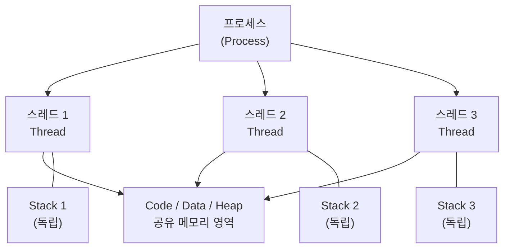
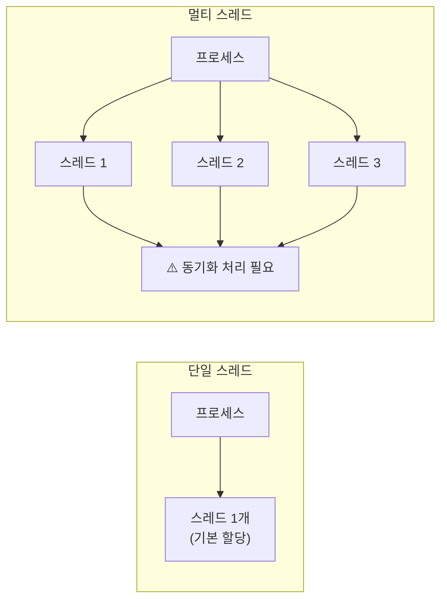
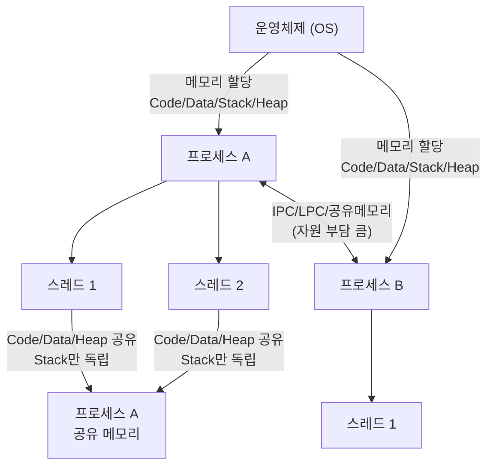

# 프로세스(Process)와 스레드(Thread)

> 면접 단골 질문이자 OS의 핵심 개념. 프로그램 → 프로세스 → 스레드 흐름을 완전히 이해하자.

---

## 목차
1. [정의](#1-정의)
2. [프로그램 → 프로세스](#2-프로그램--프로세스)
3. [프로세스 → 스레드](#3-프로세스--스레드)
4. [메모리 구조 비교](#4-메모리-구조-비교)
5. [단일 스레드 vs 멀티 스레드](#5-단일-스레드-vs-멀티-스레드)
6. [멀티 태스킹 vs 멀티 스레드](#6-멀티-태스킹-vs-멀티-스레드)
7. [멀티 스레드 장단점](#7-멀티-스레드-장단점)
8. [프로세스 간 정보 공유](#8-프로세스-간-정보-공유)
9. [결론 및 면접 답변 정리](#9-결론-및-면접-답변-정리)

---

## 1. 정의

| 용어 | 정의 | 핵심 키워드 |
|------|------|------------|
| **프로세스** | 운영체제로부터 자원을 할당받은 **작업의 단위** | 작업, OS 최소 단위 |
| **스레드** | 프로세스가 할당받은 자원을 이용하는 **실행 흐름의 단위** | 실행 흐름, CPU 최소 단위 |

> 💡 **프로세스** = "어떤 일을 해야 하는가?"  
> 💡 **스레드** = "어느 순서로 수행할 것인가?"

---

## 2. 프로그램 → 프로세스

### 개념 흐름


### 핵심 정리

- **프로그램**: 아직 실행되지 않은 파일 그 자체 (정적인 상태)
  - 메모리에 올라가 있지 않음 → OS가 독립적인 메모리 공간을 아직 할당하지 않은 상태
  - 그냥 코드 덩어리
- **프로세스**: 프로그램을 실행한 것 (동적인 상태)
  - 메모리에 올라간 순간 → 프로세스가 됨
  - 스케줄링 단계에서의 "작업"과 같은 의미

> **한 줄 요약**: 프로그램은 코드 덩어리 파일, 그 프로그램을 실행한 게 프로세스.

---

## 3. 프로세스 → 스레드

### 왜 스레드가 필요한가?

과거에는 프로세스 하나로 프로그램 전체를 처리했지만, 프로그램이 복잡해지면서 한계가 생겼다.

**"한 프로그램을 처리하기 위한 프로세스를 여러 개 만들면 안 될까?"**

→ ❌ 불가능. OS는 안전성을 위해 **프로세스마다 자신에게 할당된 메모리 내의 정보에만 접근**할 수 있도록 제약을 둠.

그래서 더 작은 실행 단위 개념이 필요하게 됨 → **스레드(Thread)**

### 스레드의 핵심



- 스레드는 **프로세스와 다르게 스레드 간 메모리를 공유**하며 작동
- 코드에 비유하면: 프로세스 = 코드 전체, 스레드 = 코드 내에 선언된 함수들 (`main` 함수도 스레드)

> **한 줄 요약**: 스레드는 프로세스의 코드에 정의된 절차에 따라 실행되는 특정한 수행 경로다.

---

## 4. 메모리 구조 비교

### 프로세스의 독립 메모리 영역 (OS가 할당)

OS는 프로세스마다 각각 독립된 메모리 영역을 `Code / Data / Stack / Heap` 형식으로 할당한다.


### 스레드 간 공유 구조 (★ 핵심)

프로세스가 할당받은 메모리 영역 내에서:
- **Stack**: 스레드마다 **따로** 할당받음 (독립)
- **Code / Data / Heap**: 같은 프로세스 내 스레드끼리 **공유**


| 메모리 영역 | 역할 | 스레드 간 |
|------------|------|----------|
| **Code** | 실행할 코드 저장 | ✅ 공유 |
| **Data** | 전역변수, 정적변수 | ✅ 공유 |
| **Heap** | 동적 할당 메모리 (읽기/쓰기 모두 가능) | ✅ 공유 |
| **Stack** | 함수 호출, 지역변수 | ❌ 스레드마다 독립 |

> ⚠️ 힙 메모리를 공유하기 때문에 → **동기화 문제(Synchronization Issue)** 발생 가능

---

## 5. 단일 스레드 vs 멀티 스레드



- **단일 스레드**: 프로세스당 하나의 스레드가 기본적으로 할당됨
- **멀티 스레드**: 프로세스에 여러 개의 스레드가 할당됨 → **반드시 동기화 처리 필요**

---

## 6. 멀티 태스킹 vs 멀티 스레드

| 구분 | 멀티 태스킹 | 멀티 스레드 |
|------|------------|------------|
| **단위** | 여러 프로세스 | 하나의 프로세스 내 여러 스레드 |
| **메모리 공유** | ❌ 각자 독립 메모리 | ✅ Code/Data/Heap 공유 |
| **Context-Switching 비용** | 크다 (캐시 메모리 초기화 포함) | 작다 (공유 메모리만큼 절약) |
| **통신 방법** | IPC, LPC, 공유 메모리 (부담 큼) | 메모리 직접 접근 (빠름) |
| **오류 영향** | 다른 프로세스에 영향 없음 | 같은 프로세스 내 모든 스레드 종료 |

> ⚠️ 멀티 태스킹: 한 번에 여러 프로세스가 동시에 돌아가는 것이 아님.  
> 프로세스 간 **Context-Switching** 시 많은 자원 손실이 발생한다.

---

## 7. 멀티 스레드 장단점

### ✅ 장점

- **Context-Switching 비용 절감**: 공유하고 있는 메모리만큼의 메모리 자원을 아낄 수 있다.
- **통신 부담 적음**: 스레드는 Stack 영역을 제외한 모든 메모리를 공유하기 때문에 통신의 부담이 적어서 응답 시간이 빠르다.
- **자원 효율**: 멀티태스킹보다 멀티스레드가 자원을 더 아낄 수 있다.

### ❌ 단점

- **전체 종료 위험**: 스레드 하나가 프로세스 내 자원을 망쳐버린다면 모든 스레드(프로세스)가 종료될 수 있다.
- **동기화 문제 필연적 발생**: 자원을 공유하기 때문에 Synchronization Issue가 발생할 수밖에 없다.
- **프로그래머가 직접 처리**: 스레드 스케줄링은 OS가 자동으로 해주지 않기 때문에 프로그래머가 직접 동기화 기법을 구현해야 한다.
- **디버깅 까다로움**

### 동기화 문제(Synchronization Issue) 상세

```
스레드 A가 자원 X 사용 중
        ↓
B로 제어권 전환 (Context-Switching)
        ↓
스레드 B가 자원 X 수정
        ↓
다시 A로 제어권 전환
        ↓
A가 수정된 자원 X에 접근 → ❌ 오류 발생 가능
```

멀티스레드를 사용하면 각각의 스레드 중 어떤 것이 어떤 순서로 실행될지 알 수 없다. 여러 스레드가 함께 전역 변수를 사용할 경우 발생하는 충돌을 **동기화 문제**라고 한다.

---

## 8. 프로세스 간 정보 공유

일반적으로 프로세스는 다른 프로세스의 정보에 접근할 수 없지만, 아래 방법으로는 가능하다.

> ⚠️ 단순 CPU 레지스터 교체뿐만 아니라 **RAM↔CPU 사이의 캐시 메모리까지 초기화**되므로 자원 부담이 크다.

| 방법 | 설명 |
|------|------|
| **IPC** (Inter-Process Communication) | 프로세스 간 통신 표준 방법 |
| **LPC** (Local inter-Process Communication) | 같은 시스템 내 프로세스 간 통신 |
| **공유 메모리** | 별도의 공유 메모리 공간을 만들어 정보 주고받음 |

---

## 9. 결론 및 면접 답변 정리

### 핵심 차이 한눈에 보기



### 면접 답변 예시

**Q: 프로세스와 스레드의 차이에 대해 말해주세요.**

> **A:**  
> 프로세스는 운영체제로부터 자원을 할당받은 작업의 단위이고, 스레드는 프로세스가 할당받은 자원을 이용하는 실행 흐름의 단위입니다.
>
> OS는 프로세스마다 독립된 메모리 영역(Code, Data, Stack, Heap)을 할당합니다. 따라서 프로세스끼리는 서로의 자원에 직접 접근할 수 없습니다.
>
> 반면 스레드는 같은 프로세스 내에서 Stack만 독립적으로 사용하고, Code / Data / Heap은 공유합니다. 이 덕분에 스레드 간 통신 비용이 적고 Context-Switching 비용도 낮습니다. 그러나 공유 자원에 대한 동기화 문제가 필연적으로 발생하며, 이는 프로그래머가 직접 처리해야 합니다.

---

## 참고

- 운영체제 관점 최소 단위: **프로세스**
- CPU 관점 최소 단위: **스레드**
- 하나의 프로세스는 하나 이상의 스레드를 반드시 가짐
- 스레드 스케줄링은 OS가 자동 처리하지 않음 → 프로그래머 직접 구현 필요
